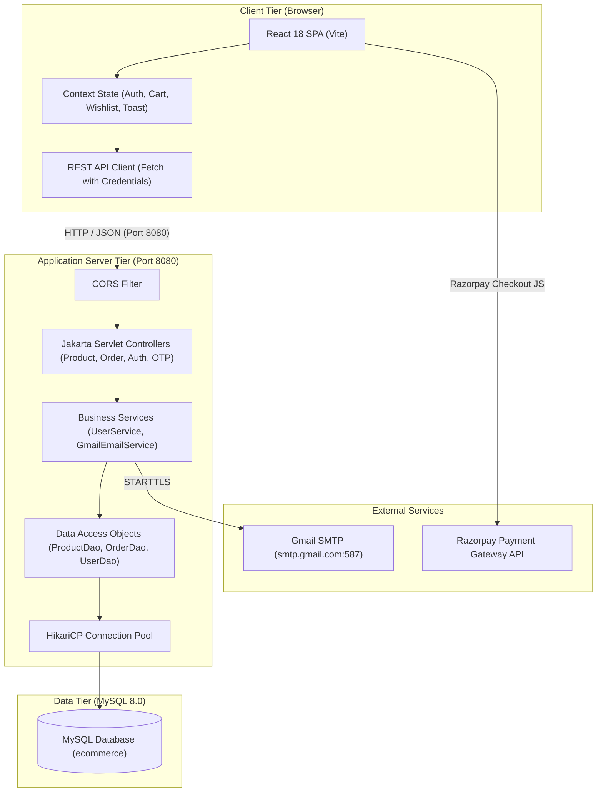

# 02. System Architecture

## 1. High-Level Architecture
SmartWay implements a multi-tier Client-Server architecture with separation of concerns between presentation, business logic, persistence, and external service providers.

## 2. Architectural Layers
1. **Presentation Layer**: Single Page Application built on React 18, React Router v6, Lucide React icons, and vanilla CSS custom properties.
2. **Controller / REST API Layer**: Jakarta Servlets (`@WebServlet`) mounted on `/api/*` handling CORS, payload deserialization via Google Gson, and HTTP status codes.
3. **Service Layer**: Handles business logic, email generation, OTP validation, and authentication checks.
4. **Data Access Layer (DAO)**: Pure JDBC DAOs with HikariCP connection pooling, parameterized queries, and ACID database transactions.
5. **Persistence Layer**: Relational MySQL database with foreign keys, indexes, and automated schema seeders.
