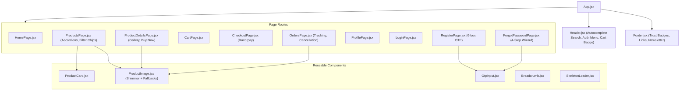

# 03. Application Architecture

## 1. Frontend Component Structure

## 2. Backend Controller & DAO Mapping
- **`ProductServlet`** $
ightarrow$ `ProductDao`: Handles catalog filtering, search, multi-brand queries, pagination, and details.
- **`FilterOptionsServlet`** $
ightarrow$ `ProductDao`: Returns dynamic filter metadata and category/brand counts.
- **`OrderServlet`** $
ightarrow$ `OrderDao`: Executes transactional order placement, stock decrement, cancellation, and retrieval.
- **`LoginServlet` & `RegisterServlet`** $
ightarrow$ `UserService` $
ightarrow$ `UserDao`: Handles user verification and credential checks.
- **`SendEmailOtpServlet` & `VerifyEmailOtpServlet`** $
ightarrow$ `GmailEmailService` $
ightarrow$ `UserDao`: Dispatches 6-digit verification codes.
