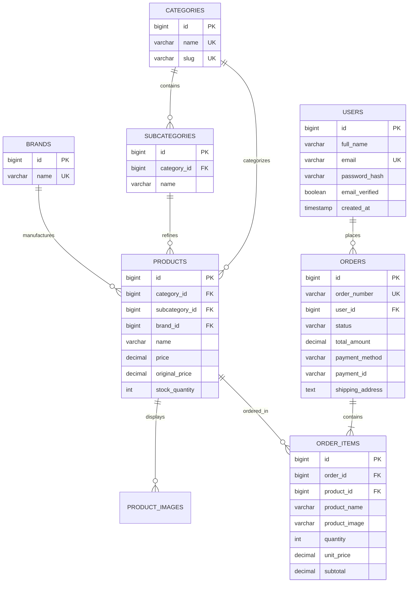

# 06. Database Architecture

## 1. Relational Entity Relationship Diagram

```mermaid
erDiagram
    USERS ||--o{ ORDERS : places
    CATEGORIES ||--o{ SUBCATEGORIES : contains
    CATEGORIES ||--o{ PRODUCTS : categorizes
    SUBCATEGORIES ||--o{ PRODUCTS : refines
    BRANDS ||--o{ PRODUCTS : manufactures
    PRODUCTS ||--o{ PRODUCT_IMAGES : displays
    ORDERS ||--|{ ORDER_ITEMS : contains
    PRODUCTS ||--o{ ORDER_ITEMS : ordered_in

    USERS {
        bigint id PK
        varchar full_name
        varchar email UK
        varchar password_hash
        boolean email_verified
        timestamp created_at
    }

    CATEGORIES {
        bigint id PK
        varchar name UK
        varchar slug UK
    }

    SUBCATEGORIES {
        bigint id PK
        bigint category_id FK
        varchar name
    }

    BRANDS {
        bigint id PK
        varchar name UK
    }

    PRODUCTS {
        bigint id PK
        bigint category_id FK
        bigint subcategory_id FK
        bigint brand_id FK
        varchar name
        decimal price
        decimal original_price
        int stock_quantity
    }

    ORDERS {
        bigint id PK
        varchar order_number UK
        bigint user_id FK
        varchar status
        decimal total_amount
        varchar payment_method
        varchar payment_id
        text shipping_address
    }

    ORDER_ITEMS {
        bigint id PK
        bigint order_id FK
        bigint product_id FK
        varchar product_name
        varchar product_image
        int quantity
        decimal unit_price
        decimal subtotal
    }
```
