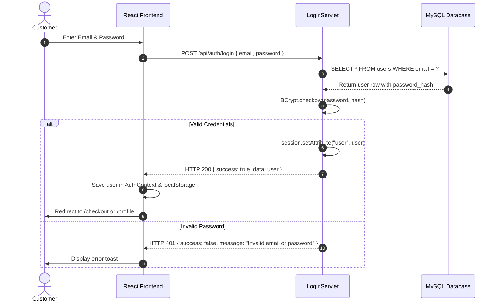

# 08. Authentication Flow

## 1. Overview
SmartWay supports guest discovery with mandatory authentication prior to checkout. Authentication leverages email verification via Gmail SMTP OTP, salted bcrypt passwords, and HTTP sessions.

