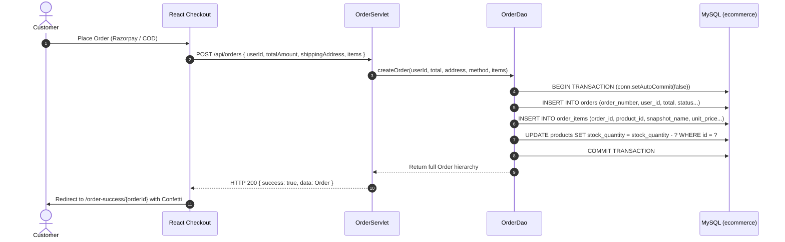

# 19. Order Flow & Transaction Management

## 1. ACID Transaction Order Placement

```mermaid
sequenceDiagram
    autonumber
    actor Customer
    participant React as React Checkout
    participant Servlet as OrderServlet
    participant DAO as OrderDao
    participant DB as MySQL (ecommerce)

    Customer->>React: Place Order (Razorpay / COD)
    React->>Servlet: POST /api/orders { userId, totalAmount, shippingAddress, items }
    Servlet->>DAO: createOrder(userId, total, address, method, items)
    DAO->>DB: BEGIN TRANSACTION (conn.setAutoCommit(false))
    DAO->>DB: INSERT INTO orders (order_number, user_id, total, status...)
    DAO->>DB: INSERT INTO order_items (order_id, product_id, snapshot_name, unit_price...)
    DAO->>DB: UPDATE products SET stock_quantity = stock_quantity - ? WHERE id = ?
    DAO->>DB: COMMIT TRANSACTION
    DAO-->>Servlet: Return full Order hierarchy
    Servlet-->>React: HTTP 200 { success: true, data: Order }
    React->>Customer: Redirect to /order-success/{orderId} with Confetti
```
